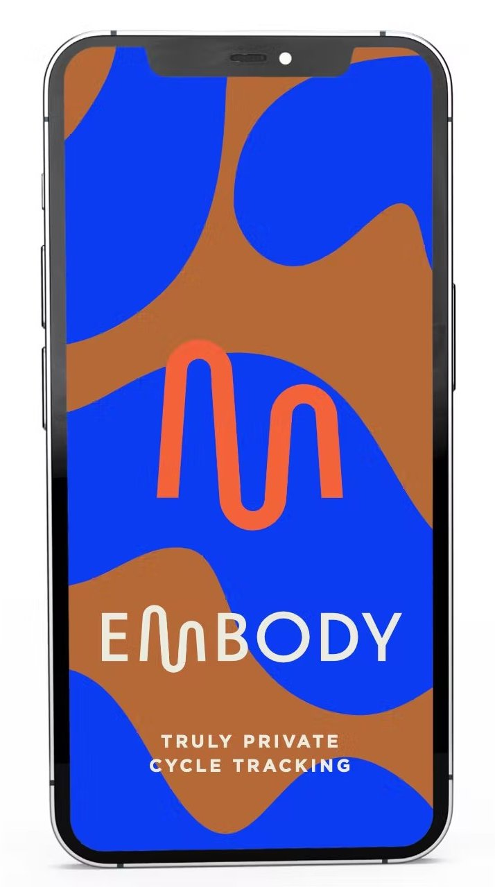

# Welcome to the Embody React Native Challenge!

  <!-- iOS -->
  
  <!-- Android -->
  
  <!-- Web -->
  

  

 

## Instructions

In this challenge we ask you use this repo in conjunction with the 
[Expo Platform](https://expo.dev) to create a scheduling app using the calender. 

This app should have **some** of the following features:

- Save a date and time with a personal note

- Remediate security vulnerabilities

- Save a date and time with an image

- Unlock the app with a password, enforcing proper security standards

- Save a date and time with the current lunar phase via API

- AA WCAG accessibile Front End interactive experience

We don't expect you complete all of these features, but they should be an opportunity for us to dive into technical discussion together and get a sense of how you solve problems. Although we do love to see your passion 🚀 we ask that you only spend a few hours on the challenge.

Because we want to see what each candidate comes up with on their own. Please take care not to fork or upload the repo publicly. When your ready just shoot a us a an invite via email. 

❤️  🔥  ⚡︎  👋  🌚  🌊  🛸

The Embody Team
